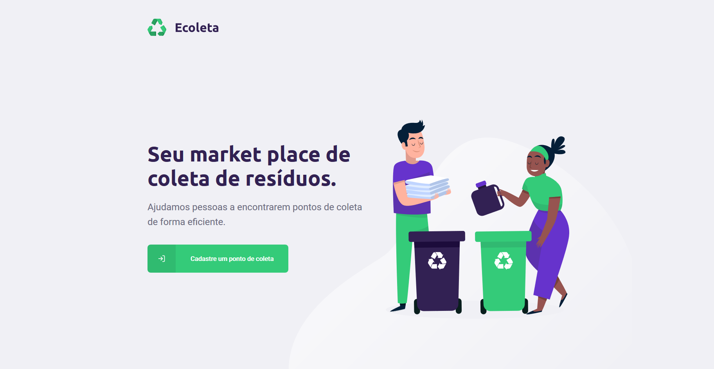

<h1 align="center">
    Next-level-week - Projeto Ecoleta ♻
</h1>
Projeto desenvolvido na Next Level Week da Rocketseat 🚀

# 💡 Sobre o projeto

O Ecoleta é uma ferramenta que tem como objetivo ajudar pessoas a encontrarem pontos de coleta de uma forma mais eficiente.

- Na versão web, os estabelecimentos podem se cadastrar preenchendo o seu endereço e os itens que coletam.

- Na versão mobile, os usuários podem localizar estes estabelecimentos filtrando-os pela localização que desejar. Além disso, o usuário tem a possibilidade de entrar em contato com o estabelecimento por meio do whatsapp ou e-mail previamente cadastrado.

# 🚀 Tecnologias utilizadas

Algumas das tecnologias que foram utilizadas para o desenvolvimento deste projeto:

- [ReactJS](https://reactjs.org/)
- [React native](https://reactnative.dev/)
- [TypeScript](https://www.typescriptlang.org/)
- [NodeJS](https://nodejs.org/en/)
- [Expo](https://expo.io/)
- [Knex](http://knexjs.org/)
- [SQLite](https://www.sqlite.org/index.html)

